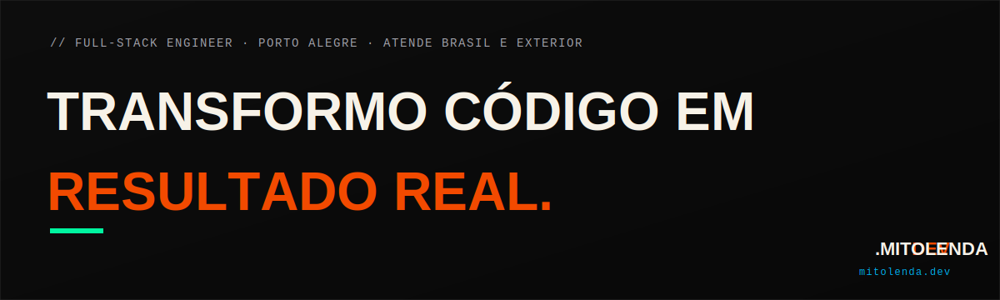

<p align="center">
  
</p>

<p align="center">
  <a href="https://github.com/Mit0lenda/PortFolio/actions/workflows/ci.yml"></a>
  <a href="https://github.com/Mit0lenda/PortFolio/actions/workflows/lighthouse.yml"></a>
  <a href="https://nextjs.org"></a>
  <a href="https://www.typescriptlang.org"></a>
  <a href="https://supabase.com"></a>
  <a href="https://playwright.dev"></a>
  <a href="https://mitolenda.dev"></a>
</p>

Site institucional/portfólio da Dev Mitolenda. Next.js 15 (App Router) + Supabase, deploy via Docker no Easypanel atrás de um Cloudflare Tunnel.

---

### // 00 — Sobre

**Nicollas Freitas** · Porto Alegre/RS

Estudante de Ciência da Computação na Unisinos + UERGS, dev fullstack e ex-estagiário da Polícia Federal na área de perícia digital. Hoje atende PMEs e negócios locais do Brasil inteiro como dev solo — foco em entregar coisa que entra em produção e gera dinheiro, não vitrine de portfólio.

| | |
|---|---|
| 🥉 3º lugar nacional | iTwin4Good BR |
| 🚀 Startup incubada | CEI-UFRGS |
| 🔬 Perícia digital | Estágio · Polícia Federal |

---

### // 01 — Stack

| Camada | Tecnologia |
|---|---|
| Framework | Next.js 15 (App Router, TypeScript, React 19) |
| Estilo | CSS puro (`src/app/globals.css`) |
| Banco | Supabase (Postgres) — schema `portfolio`, tabela `leads` |
| Automação | Webhook n8n disparado no envio do formulário (classificação/auto-resposta) |
| Chat | Widget Chatwoot embutido |
| Analytics | Cloudflare Web Analytics (cookieless) + Facebook Pixel (opcional) |
| Testes | Playwright (smoke e2e, desktop + mobile) |
| CI | GitHub Actions — lint, typecheck, build, testes + Lighthouse CI contra produção |
| Deploy | Docker (multi-stage, non-root, healthcheck) → Easypanel → Cloudflare Tunnel |

---

### // 02 — Rodando localmente

```bash
npm install
cp .env.example .env.local   # preencher com valores reais, ver seção abaixo
npm run dev                  # http://localhost:3000
```

| Comando | O que faz |
|---|---|
| `npm run dev` | Ambiente de desenvolvimento |
| `npm run build` | Build de produção |
| `npm run start` | Roda o build de produção localmente |
| `npm run lint` | ESLint |
| `npm run test:e2e` | Playwright (sobe build+start automaticamente se preciso) |

---

### // 03 — Variáveis de ambiente

Lista completa e comentada em [`.env.example`](.env.example). Resumo:

| Variável | Obrigatória? | Descrição |
|---|---|---|
| `NEXT_PUBLIC_SUPABASE_URL` / `NEXT_PUBLIC_SUPABASE_ANON_KEY` | Sim | Projeto Supabase dedicado do portfólio (schema `portfolio`) |
| `N8N_CONTACT_WEBHOOK_URL` | Não | Webhook do fluxo n8n de notificação de lead |
| `NEXT_PUBLIC_CF_ANALYTICS_TOKEN` | Não | Cloudflare Web Analytics |
| `NEXT_PUBLIC_FB_PIXEL_ID` | Não | Facebook Pixel (pageview + eventos de CTA) — ao habilitar, atualizar a política de privacidade se ainda não refletir |
| `NEXT_PUBLIC_GOOGLE_SITE_VERIFICATION` | Não | Verificação de propriedade no Search Console |

---

### // 04 — Banco de dados (Supabase)

Schema oficial em [`docs/supabase-setup.sql`](docs/supabase-setup.sql), com atribuição completa de lead (`page_url`, `utm_source`, `utm_medium`, `utm_campaign`, `lang`) adicionada por [`docs/supabase-migration-002-lead-attribution.sql`](docs/supabase-migration-002-lead-attribution.sql) — já aplicada em produção. Ambos os arquivos são idempotentes, seguros para rodar de novo se precisar recriar o ambiente.

---

### // 05 — Deploy

1. Build da imagem Docker ([`Dockerfile`](Dockerfile), multi-stage, non-root, `HEALTHCHECK` embutido).
2. Deploy no Easypanel apontando pra porta `3000`.
3. Tunnel Cloudflare (`cloudflared`) faz o ingress `https://mitolenda.dev` → `http://<service-name>:3000`.
4. Variáveis de ambiente configuradas direto no Easypanel (não versionadas).

**Smoke test pós-deploy**

- [ ] Home carrega (`https://mitolenda.dev/`)
- [ ] `https://www.mitolenda.dev/` redireciona corretamente pro domínio raiz
- [ ] `http://` redireciona pra `https://`
- [ ] Formulário de contato envia e mostra mensagem de sucesso
- [ ] CTA de WhatsApp abre o link certo
- [ ] `/sitemap.xml` e `/robots.txt` respondem 200
- [ ] Nenhum erro novo no console do navegador

**Rollback**: deploy é feito via imagem Docker versionada no Easypanel — para reverter, redeploy do commit/tag anterior que já estava em produção antes da mudança problemática.

---

### // 06 — Testes

[`e2e/smoke.spec.ts`](e2e/smoke.spec.ts) cobre: home sem erro de console, menu mobile (abrir/fechar/navegação por teclado), CTA de WhatsApp, formulário de contato (caso válido e inválido), página 404, e uma página de serviço. Roda em dois projetos (`desktop`/`mobile`) via [`playwright.config.ts`](playwright.config.ts).

```bash
npx playwright install --with-deps chromium   # primeira vez
npm run test:e2e
```

---

### // 07 — Pendências conhecidas

Itens fora do escopo de código, não bloqueantes:

- **Monitoramento de erro** (Sentry ou equivalente) — hoje os erros só vão pra `console.error`/logs do provedor.
- **Uptime monitor** externo (UptimeRobot/Better Stack) — não configurado.
- **Rate limit distribuído** — o rate limit do `/api/contact` é em memória por instância; funciona bem com uma única instância, mas não é compartilhado se houver múltiplas réplicas.

